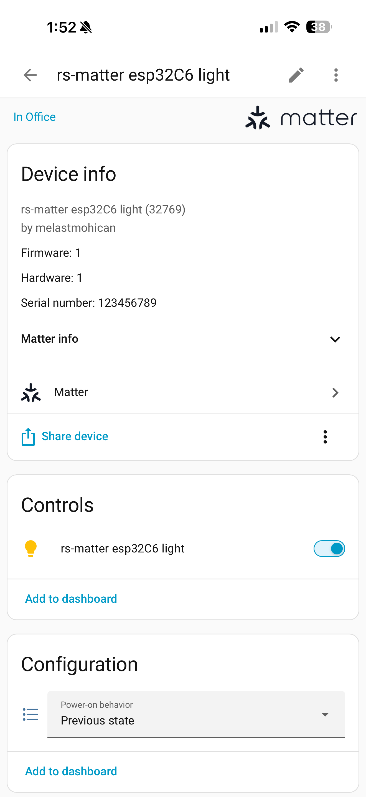
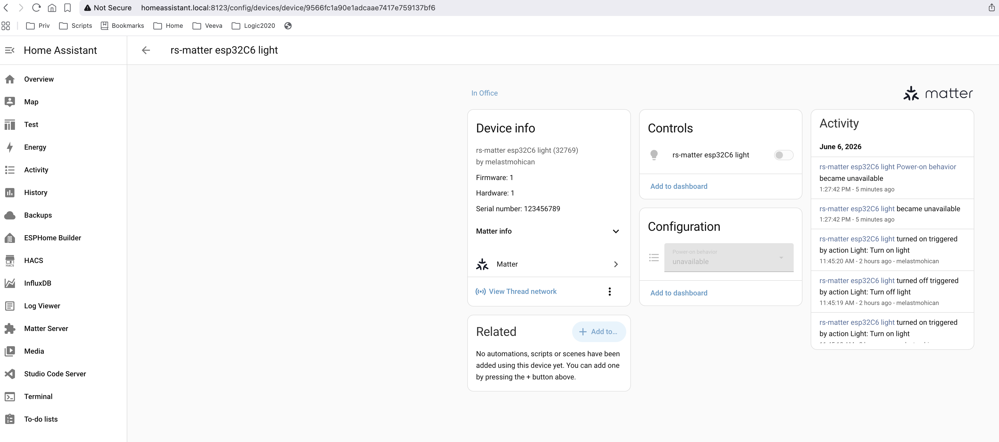
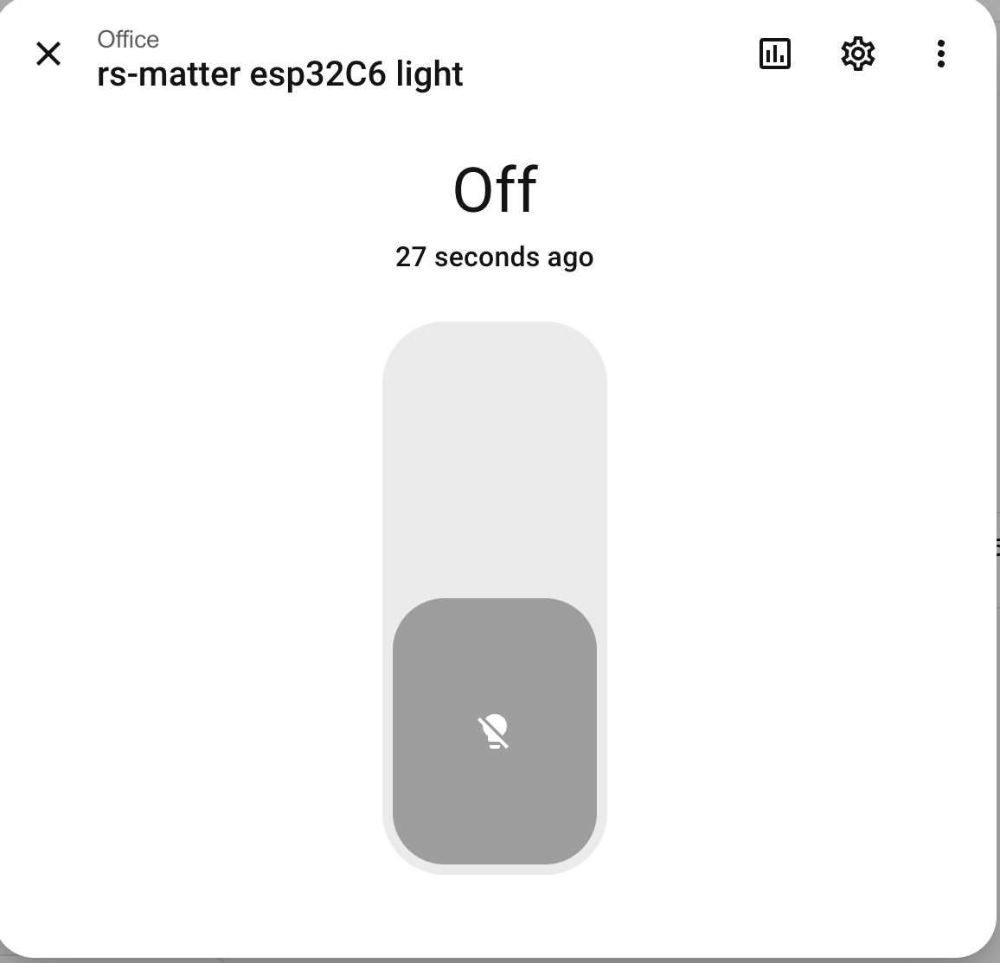
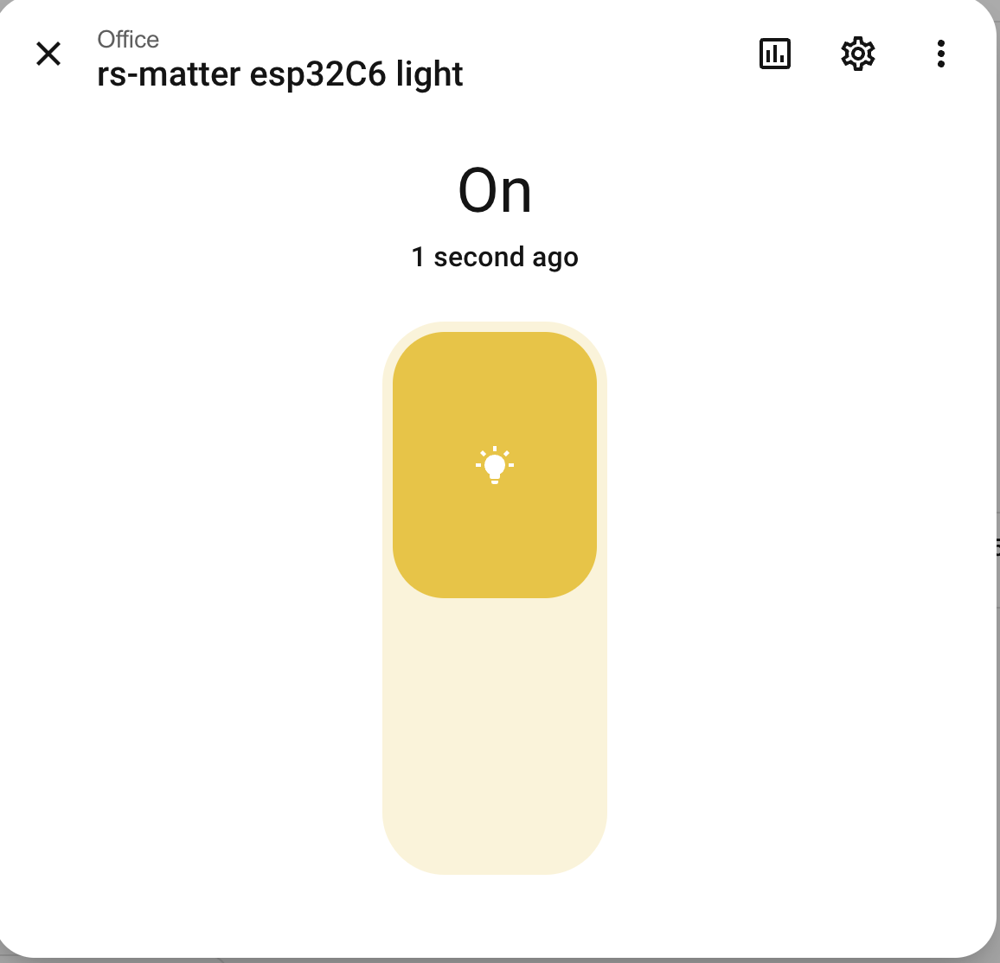
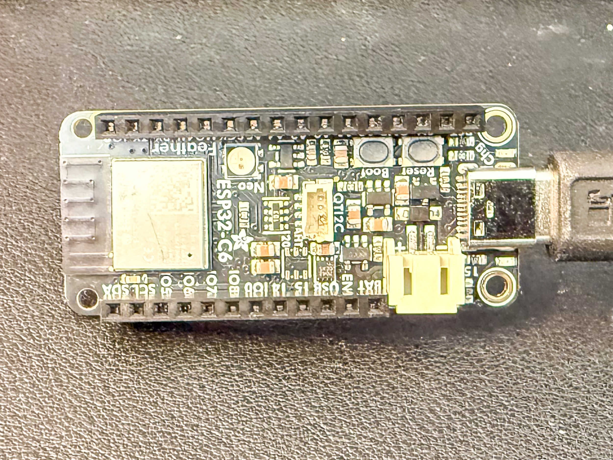
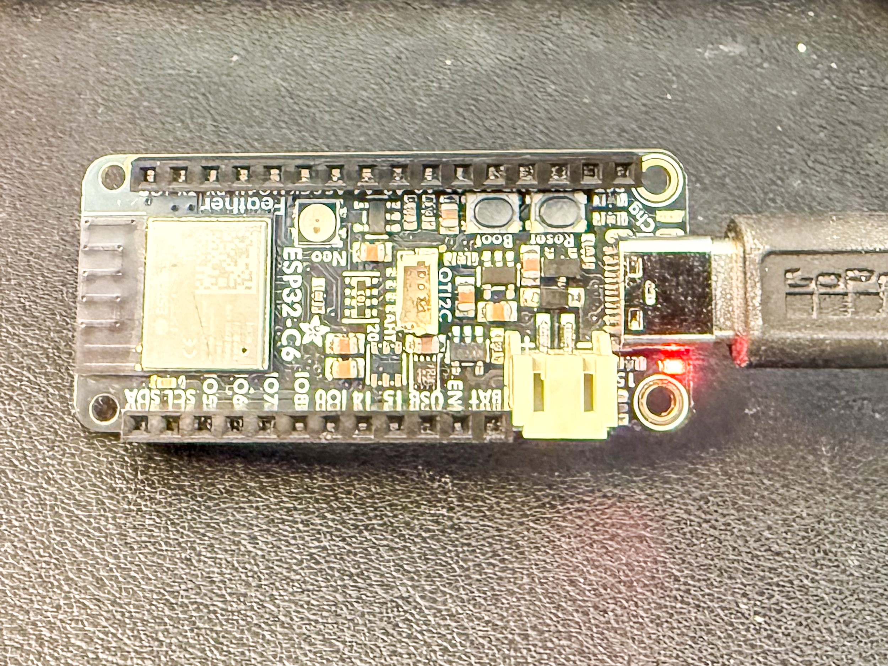

# adafruit-feather-esp32c6-embassy-examples
This repository contains examples for the [Adafruit ESP32-C6 Feather](https://www.adafruit.com/product/5933) board, written in Rust using the [Embassy](https://embassy.dev/) async framework. 

## Hardware


## Documentation

- [Primary Guide: Adafruit ESP32-C6 Feather](https://learn.adafruit.com/adafruit-esp32-c6-feather)
- [Adafruit Feather ESP32-C6 PrettyPins](https://github.com/adafruit/Adafruit-ESP32-C6-Feather-PCB/blob/main/Adafruit%20Feather%20ESP32-C6%20PrettyPins%202.pdf)

## Examples

The examples are grouped by the communication protocol they use.

---

### Matter / Thread Examples

#### matter_thread_light

Demonstrates a Matter On-Off Light device operating over Thread. The light can be commissioned and controlled via a Matter controller such as Home Assistant.

```bash
cargo run --example matter_thread_light
```

> [!IMPORTANT]
> **Reprovisioning Requirement:** This example is configured to use a temporary, RAM-only Key-Value store (`DummyKvBlobStore`) to hold its Matter operational credentials. Because credentials are not persisted to Non-Volatile Storage (Flash), the device will completely reset its pairing state on every restart or reflash. You must remove the previous device instance from Home Assistant and pair it as a new device every time you re-run the example.

### Control and Onboarding in Home Assistant

#### 1. Home Assistant App (Successful Provisioning)
What you will see in the Home Assistant mobile app once the device is successfully provisioned:



#### 2. Home Assistant Device Overview
The commissioned device details and diagnostics inside the Home Assistant dashboard:



#### 3. Dashboard Controls (ON / OFF)
Toggling the light state directly from the Home Assistant dashboard:

| Device State: OFF | Device State: ON |
| :---: | :---: |
|  |  |

### Physical Device State

The actual physical behavior on the Adafruit Feather ESP32-C6 board:

| Physical LED: OFF | Physical LED: ON |
| :---: | :---: |
|  |  |

**Hardware:**

- Board: Adafruit Feather ESP32-C6
- LED: Connect an LED to GPIO 15 (pin labeled "15")

**Compilation Requirements (OpenThread):**

Building the embedded OpenThread stack requires C toolchain tools for compiling and binding the OpenThread C sources:
1. **Clang / LLVM:** Required by `bindgen` to generate the Rust bindings for the OpenThread C libraries.
2. **RISC-V Cross Compiler:** A GCC toolchain for RISC-V targets (such as `riscv32-unknown-elf-gcc` or `riscv-none-elf-gcc`) must be available in your `PATH` so the `cc` build script can compile OpenThread for the ESP32-C6 target.

**Provisioning & Commissioning Fixes:**

To successfully provision the device with Home Assistant / standard controllers, the following fixes were applied:
1. **Dummy Wireless Network Scan (`NoopWirelessNetCtl::scan`):**
   During concurrent BLE/Thread commissioning, the commissioner queries the device for a Wi-Fi network scan. Since this is a Thread-only example and Wi-Fi is stubbed out, the scan function returns `Ok(())` instead of `NotImplemented` to prevent the controller from aborting the commissioning session in an infinite loop.
2. **Logging Demotion in Interaction Model Status Responses:**
   The controller speculatively queries unsupported optional attributes/clusters (e.g., ICD Management or Ethernet Diagnostics). The code has been patched (`rs-matter` crate under `rs-matter/rs-matter/src/dm/types/reply.rs`) to log these spec-compliant `UnsupportedCluster`/`UnsupportedAttribute` status responses as `debug!` rather than `error!`, cleaning up console spam.

**Expected Output:**

On initial boot, the device generates a commissioning QR code and passcode:

```text
[INFO ] Starting matter_thread_light over Thread...
[INFO ] Device is not commissioned yet, opening commissioning window...
[INFO ] PASE Basic Commissioning Window opened
[INFO ] SetupQRCode: [MT:-24J06PF15DA064IJ3P0WISA0DK5N1K8SQ1RYCU1O0]
[INFO ] PairingCode: [3333-1712-336]
[INFO ] █████████████████████████████████████
[INFO ] █████████████████████████████████████
[INFO ] ████ ▄▄▄▄▄ ████▄█   ▀█▄███ ▄▄▄▄▄ ████
...
[INFO ] OpenThread instance initialized
[INFO ] Thread and BLE drivers started
[INFO ] BLE driver started
[INFO ] Running in concurrent commissioning mode (BLE and Wireless)
[INFO ] Starting advertising and GATT service
[INFO ] Running operational and commissioning networks
[INFO ] Running Matter transport
[INFO ] Netif down
[INFO ] GATT: Connection established
[INFO ] Got Arm Fail Safe Request, expiry 120s
...
[INFO ] Thread scan complete
[INFO ] Connecting to Thread network, dataset: ...
[INFO ] Plat radio set PAN ID callback, PAN ID: 0x868c
[INFO ] [OpenThread] [N] 00000000000Mle-----------: Role detached -> child
[INFO ] Netif change detected.
    New: NetifState { ipv6: fdd2:925b:1861:0001:67c8:1322:1c08:fcb3, operational: true, ... }
[INFO ] Netif up: NetifState { ... }
[INFO ] Running mDNS
[INFO ] Registered SRP host 06B4BC1CFE954E58
[INFO ] Added service Commissionable { id: 15444484668633655626, discriminator: 3789, enhanced: false }
[INFO ] Added service Commissioned { compressed_fabric_id: 9562767678025059158, node_id: 12245242 }
[INFO ] Got Commissioning Complete Request
[INFO ] PASE Commissioning Window closed
[INFO ] Commissioning complete, fabric and network settings persisted
[INFO ] GATT: Peer unsubscribed
[INFO ] GATT: Events task finished
```

